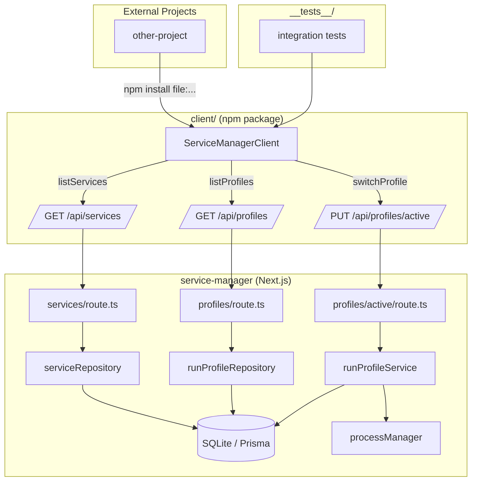
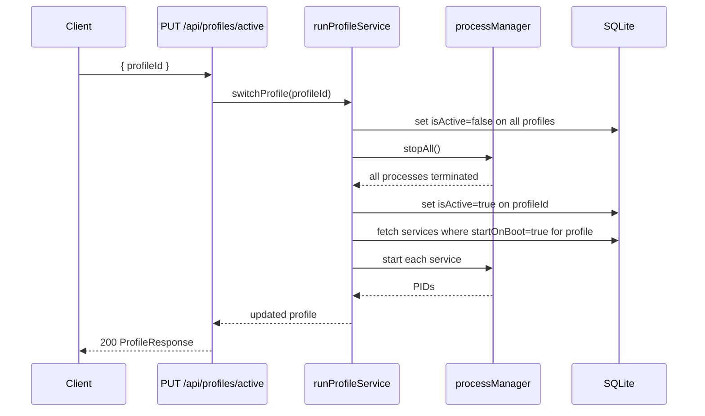

# TDD: API Enhancements & TypeScript Client Library

## Introduction

The service-manager currently exposes a Next.js API for managing services and profiles, but some endpoints omit key fields (ports, cuda devices, scripts), and there is no client library for external projects to consume the API. This document covers two work streams: (1) enriching existing API responses and adding a profile-switch endpoint, and (2) building a standalone TypeScript client library with its own build pipeline that wraps those endpoints.

The client library is intended for local installation only (not npm-published), allowing sibling projects to import typed, promise-based methods instead of writing raw `fetch` calls.

---

## Goals and Non-Goals

**Goals**
- `GET /api/services` returns `port`, `cudaDevice`, and `command` (the "script") for every service.
- `GET /api/profiles` returns each profile's services with their `cudaDevice` and `port`.
- `PUT /api/profiles/active` switches the active profile (stop all → start new profile's auto-start services) — mirrors UI behavior.
- A `client/` package at repo root compiles to CJS + ESM, exports fully-typed wrappers for all three endpoints.
- Existing tests are migrated to use the client; new integration tests cover the client round-trip.
- A `README.md` in `client/` documents local installation.

**Non-Goals**
- Publishing to npm.
- Adding new service or profile CRUD endpoints.
- Changing the database schema.
- Browser/React usage of the client library (Node.js consumers only for now).

---

## Problem Statement

External projects that want to automate service management must write their own fetch logic against an undocumented, untyped API. Additionally, `GET /api/services` and `GET /api/profiles` omit fields that callers need (port, cuda device, command/script), forcing consumers to make multiple requests or read source code to understand the data shape. Profile switching exists in the UI but has no reliable API contract.

---

## Architectural Overview



---

## Detailed Technical Sections

### Components and Interfaces

#### 1. API Response Shape Changes

**`GET /api/services`** — add missing fields to each service object:

```ts
interface ServiceResponse {
  id: string;
  name: string;
  description: string;
  command: string;       // "script" — already in DB, just ensure it's returned
  port: number | null;
  cudaDevice: string | null;
  startOnBoot: boolean;
  status: 'running' | 'stopped' | 'error';
  pid: number | null;
  createdAt: string;
  updatedAt: string;
}
```

Currently `serviceRepository.findAll()` already selects all columns — verify the API route maps them through without dropping fields.

**`GET /api/profiles`** — each profile includes its services with overrides applied:

```ts
interface ProfileServiceEntry {
  serviceId: string;
  name: string;
  port: number | null;
  cudaDevice: string | null;   // profile-level override wins
  startOnBoot: boolean;
}

interface ProfileResponse {
  id: string;
  name: string;
  isActive: boolean;
  services: ProfileServiceEntry[];
  createdAt: string;
  updatedAt: string;
}
```

The `RunProfileService` junction table already stores per-profile `cudaDevice` and `startOnBoot` overrides. The repository join query needs to include the base service's `port` and `name`.

**`PUT /api/profiles/active`** — already exists; confirm it stops current services and starts new profile's `startOnBoot` services (same as UI). No schema change needed; ensure the response returns the newly activated `ProfileResponse`.

#### 2. Client Library (`client/`)

```
client/
├── package.json
├── tsconfig.json
├── tsconfig.build.json
├── src/
│   └── index.ts          ← ServiceManagerClient class + all types
├── dist/                 ← compiled output (gitignored)
└── README.md
```

**`package.json`** key fields:

```json
{
  "name": "service-manager-client",
  "version": "1.0.0",
  "main": "dist/cjs/index.js",
  "module": "dist/esm/index.js",
  "types": "dist/types/index.d.ts",
  "scripts": {
    "build": "tsc -p tsconfig.build.json && tsc -p tsconfig.esm.json",
    "dev": "tsc -p tsconfig.build.json --watch"
  }
}
```

**`ServiceManagerClient` API:**

```ts
export class ServiceManagerClient {
  constructor(private baseUrl: string) {}

  listServices(): Promise<ServiceResponse[]>
  listProfiles(): Promise<ProfileResponse[]>
  getActiveProfile(): Promise<ProfileResponse>
  switchProfile(profileId: string): Promise<ProfileResponse>
  startService(serviceId: string): Promise<void>
  stopService(serviceId: string): Promise<void>
}
```

All methods throw a typed `ServiceManagerError` on non-2xx responses.

#### 3. Dependency Map

| Layer | File | Change |
|---|---|---|
| API route | `src/app/api/services/route.ts` | Verify `command`, `port`, `cudaDevice` are in response |
| API route | `src/app/api/profiles/route.ts` | Join service name + port into response |
| Repository | `src/lib/runProfileRepository.ts` | Extend findAll query to include service `port`, `name` |
| Client | `client/src/index.ts` | New file — full client implementation |
| Tests | `src/__tests__/*.test.ts` | Replace raw fetch with client methods |

---

### Data Flows and Security

#### Profile Switch Flow



#### Error Handling

| Scenario | HTTP Status | Client behavior |
|---|---|---|
| Unknown profileId | 404 | throws `ServiceManagerError` |
| Process fails to stop | 500 | throws, profile NOT switched |
| Service fails to start | 207 | partial — log warning, return profile |

#### Security

- No auth is added (out of scope; this is a local tool).
- `baseUrl` in client is caller-supplied — no URL injection risk beyond what fetch already provides.
- No new file-system access or shell commands introduced.

---

## Alternatives Considered

| Option | Pros | Cons |
|---|---|---|
| **OpenAPI codegen client** | Auto-generated, always in sync | Requires maintaining OpenAPI spec; heavy tooling |
| **Shared types package only** (no client methods) | Lightweight | Callers still write fetch logic; no DX improvement |
| **Publish to npm** | Standard distribution | Overkill for a local-only tool; requires versioning discipline |
| **Single tsconfig in root** | Simpler | Couples client build to Next.js; breaks tree-shaking for consumers |

Chosen approach (hand-written client, `file:` install) is the lightest path that gives typed DX to external consumers without new infrastructure.

---

## Testing Strategy

All tests are integration-style: spin up the real Next.js dev server (or use `next build && next start` in test setup) and call through the client. Avoid mocking HTTP.

### Test Cases

**`client/__tests__/client.integration.test.ts`**

```
describe('ServiceManagerClient')
  ✓ listServices() returns array with port, cudaDevice, command fields present
  ✓ listProfiles() returns profiles each with services array containing port and cudaDevice
  ✓ getActiveProfile() returns the currently active profile
  ✓ switchProfile(id) activates the given profile and returns it as active
  ✓ switchProfile(unknownId) throws ServiceManagerError with status 404
  ✓ startService(id) starts a stopped service (status becomes running)
  ✓ stopService(id) stops a running service (status becomes stopped)
```

**Migration: update existing tests to use client**

- `serviceService.test.ts` — replace direct import of serviceService with client calls where applicable (start/stop/list).
- `runProfileService.test.ts` — replace direct calls with `client.listProfiles()` and `client.switchProfile()`.

### Test Setup

```ts
// client/__tests__/setup.ts
const BASE_URL = process.env.SERVICE_MANAGER_URL ?? 'http://localhost:4000';
export const client = new ServiceManagerClient(BASE_URL);
```

Tests assume the server is running (can be started via `npm run dev` in CI before the test suite). Seed data via Prisma test helpers already in `src/__tests__/setup.ts`.
