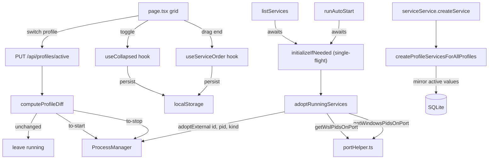
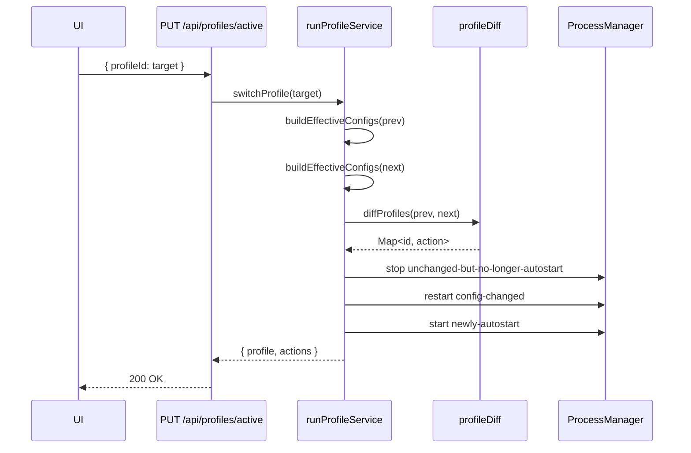
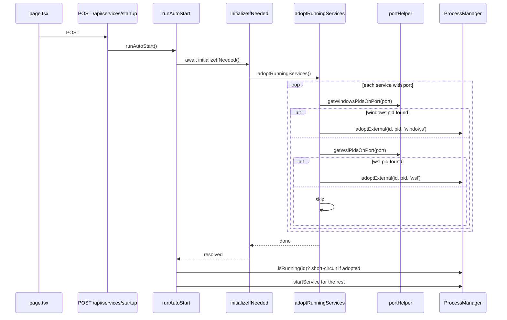

# TDD: Only Restart Diff, Attach Running, Profile Sync, UI Reorder/Collapse

## Introduction

Today, switching between Run Profiles unconditionally stops every running service and then starts the new profile's auto-start set. This wastes time and disrupts services whose configuration is identical across profiles (e.g. `vllm` on the same port and CUDA device in both profiles). The first goal of this work is to make profile switching a *diff-driven* operation: only restart services whose effective config changed.

The same restart-aversion theme applies to dev workflows — `npm run dev` causes Next.js hot reloads, which currently re-instantiate the in-memory `ProcessManager` and try to re-spawn services that are already running, producing `EADDRINUSE` errors. We need to detect already-running ports and adopt them rather than re-spawn. Finally, we tighten up two existing rough edges (services not appearing in all profiles when newly created) and add two UI features (drag-reorder, collapse/expand) with persisted state.

---

## Goals and Non-Goals

**Goals**
- Profile switch only stops/starts services whose effective config (port, cudaDevice, command, autostart) differs from the previous profile.
- On startup, if a service's port is already listening, adopt the listening PID into `ProcessManager` instead of re-spawning.
- Adopted services show their **live logs** in the service card terminal, including history written before service-manager restarted — indistinguishable from a service started inside the UI.
- Creating a new service guarantees a `RunProfileService` row exists for every profile, with the creating profile's values mirrored as the default.
- Service cards can be drag-reordered; order is persisted per-user (localStorage acceptable for v1) and survives reload.
- Service cards have a collapse toggle that hides the terminal output area; collapsed state persists per-service per-user.

**Non-Goals**
- Cross-device sync of UI state (order, collapse).
- Per-profile reorder (one global order across profiles).
- Re-architecting `ProcessManager` to be hot-reload safe beyond the existing `globalThis` trick.
- Log rotation / archival. Per-service log files are truncated on spawn and capped at a max size while running; we do not keep historical logs across runs.

---

## Problem Statement

1. **Unnecessary restarts on profile switch.** `runProfileService.switchProfile` (src/lib/services/runProfileService.ts:60) iterates every service and calls `processManager.stopService` if running, then starts auto-start services for the new profile. There is no diff. A service unchanged between profiles still pays the stop/start cost (load model weights, reconnect clients, etc.).

2. **EADDRINUSE on dev restart — adoption is not actually running before autostart.** Next.js dev server's full restart wipes the `globalThis.processManagerInstance` map while child processes (and their listening ports) survive. The current adoption code at `serviceService.initializeIfNeeded` (src/lib/services/serviceService.ts:9) is the only place that tries to attach, and it has three problems:

   - **Wrong entry point.** Page load fires `POST /api/services/startup` → `runAutoStart` (src/app/page.tsx:53, src/lib/services/serviceService.ts:217). `runAutoStart` calls `ensureDefaultProfile` but **not** `initializeIfNeeded`. So on a fresh boot, the autostart loop runs first against an empty `ProcessManager`, sees `isRunning === false` for every service, and re-spawns → EADDRINUSE. Adoption only runs later when `GET /api/services` arrives.
   - **Stale DB gate.** Adoption only triggers when the DB row says `pid != null AND status='running'`. If the previous service-manager exited without flushing (kill -9, crash, force-stop of `npm run dev`), the row may show `status='stopped'` while the OS process is still alive. Truth lives in the OS, not the DB.
   - **WSL processes never adopted.** Many of our services run inside WSL (llama.cpp, vllm). Their PIDs are not visible to Windows `netstat`/`taskkill`. We have `getWslPidsOnPort` and `killWslPids` helpers (src/lib/util/portHelper.ts:32, 65) but they are never wired into adoption.

3. **Services missing from profiles.** `createProfileServicesForAllProfiles` (src/lib/repositories/runProfileRepository.ts:86) does fan-out, but we have no integration test asserting a freshly created service shows up correctly when switching to a previously-existing profile, and the active-profile values aren't always mirrored to other profiles in the way the requirements expect.

4. **No reorder, no collapse.** `src/app/page.tsx:167` renders services in DB insertion order with no way to rearrange. Each `ServiceCard` always renders a 280px terminal, which makes the grid unwieldy when many services are configured.

---

## Architectural Overview



---

## Detailed Technical Sections

### 1. Profile Switch Diff

#### Effective config

For each service, compute an `EffectiveConfig` for the source profile and target profile:

```typescript
interface EffectiveConfig {
  serviceId: string
  command: string         // global
  port: number | null     // global
  cudaDevice: string | null // profile override
  startOnBoot: boolean    // profile override
}

function configKey(c: EffectiveConfig): string {
  return JSON.stringify([c.command, c.port, c.cudaDevice, c.startOnBoot])
}
```

#### Diff algorithm

```typescript
type Action = 'start' | 'stop' | 'restart' | 'noop'

function diffProfiles(prev: EffectiveConfig[], next: EffectiveConfig[]): Map<string, Action> {
  // For each serviceId:
  //   - in next.startOnBoot=false and currently running:           stop
  //   - in next.startOnBoot=true and not running:                  start
  //   - running AND configKey differs (cudaDevice/port/command):   restart
  //   - else:                                                      noop
}
```

`isRunning` source of truth is `processManager.isRunning(serviceId)`, not the DB. A service that is running but not auto-start in the new profile is stopped (the user explicitly de-selected it). A service that is auto-start in both profiles with identical config: noop.

#### New file

`src/lib/services/profileDiff.ts` — pure function, easily unit-tested.

#### Wiring

`runProfileService.switchProfile`:

```typescript
const prevConfigs = await buildEffectiveConfigs(prevProfile.id)
const nextConfigs = await buildEffectiveConfigs(targetId)
const actions = diffProfiles(prevConfigs, nextConfigs)

await runProfileRepository.setActive(targetId)

for (const [serviceId, action] of actions) {
  if (action === 'stop')    await processManager.stopService(serviceId, ...)
  if (action === 'start')   await processManager.startService(serviceId, command, env, ...)
  if (action === 'restart') await processManager.restartService(serviceId, command, env, ...)
}
```

### 2. Attach Already Running Services

Three coordinated changes: a single-flight init that **runs before any spawn path**, a port-based adoption pass (Windows + WSL), and a kill-path that respects the adopted PID's origin.

#### 2a. Single-flight init, called from every entry point

Replace the bare `globalForInit.processManagerInitialized` boolean with a cached promise so concurrent callers all await the same adoption pass:

```typescript
const globalForInit = globalThis as unknown as { initPromise?: Promise<void> }

function initializeIfNeeded(): Promise<void> {
  if (!globalForInit.initPromise) {
    globalForInit.initPromise = (async () => {
      await ensureDefaultProfile()
      await adoptRunningServices()
    })()
  }
  return globalForInit.initPromise
}
```

Wire it into **every** entry point that may spawn or read live status:

| Entry point | File:line | Change |
|---|---|---|
| `runAutoStart` | src/lib/services/serviceService.ts:217 | `await initializeIfNeeded()` at the top, before the `hasBootStarted` check |
| `listServices` | src/lib/services/serviceService.ts:64 | already awaits — verify the new promise is awaited |
| `startService` / `restartService` | src/lib/services/serviceService.ts:153, 197 | `await initializeIfNeeded()` at the top |
| `switchProfile` | src/lib/services/runProfileService.ts:60 | `await initializeIfNeeded()` at the top |

This guarantees: **no spawn path can run until the adoption pass has completed.**

#### 2b. Port-based adoption (Windows + WSL)

Add two new helpers in `portHelper.ts` that snapshot the *whole machine* once, returning a `port → pid[]` map. Per-service lookups are then in-memory:

```typescript
// new in portHelper.ts
export async function snapshotWindowsListeners(): Promise<Map<number, number[]>>
export async function snapshotWslListeners(): Promise<Map<number, number[]>>
```

Each calls `netstat -ano | findstr LISTENING` / `wsl ss -tlnp` once and parses all listening ports.

```typescript
type AdoptionKind = 'windows' | 'wsl'

async function adoptRunningServices() {
  const [winMap, wslMap] = await Promise.all([
    snapshotWindowsListeners(),
    snapshotWslListeners(),
  ])
  const services = await serviceRepository.findAll()

  for (const svc of services) {
    if (!svc.port) continue
    if (processManager.isRunning(svc.id)) continue

    const winPid = winMap.get(svc.port)?.[0]
    if (winPid !== undefined) {
      processManager.adoptExternal(svc.id, winPid, 'windows')
      await serviceRepository.update(svc.id, { status: 'running', pid: winPid })
      continue
    }

    const wslPid = wslMap.get(svc.port)?.[0]
    if (wslPid !== undefined) {
      processManager.adoptExternal(svc.id, wslPid, 'wsl')
      await serviceRepository.update(svc.id, { status: 'running', pid: wslPid })
    }
  }
}
```

Truth source is the OS, not the DB. The DB row's prior `pid`/`status` is ignored on adoption (we update the DB to match what we observe). `restoreFromDb` (src/lib/process-manager.ts:53) becomes dead code — remove it.

#### 2c. ProcessManager: track adoption kind

Extend `ServiceProcess`:

```typescript
interface ServiceProcess {
  // ...existing fields
  adoption?: 'windows' | 'wsl'   // set when the PID was adopted, not spawned
}
```

New method:

```typescript
adoptExternal(serviceId: string, pid: number, kind: AdoptionKind): void {
  this.processes.set(serviceId, {
    id: serviceId,
    process: null,
    status: 'running',
    output: [`[Adopted external ${kind} process pid=${pid}]`],
    pid,
    adoption: kind,
  })
  this.emit('status-change', serviceId, 'running')
}
```

`startService` already short-circuits when `existing.status === 'running'` — verify it works with `process === null` (currently it checks `existing?.process && existing.status === 'running'` at src/lib/process-manager.ts:100, which **misses** adopted entries because `process === null`). **Fix that condition** to `existing?.status === 'running'` so a redundant start on an adopted service becomes a no-op (or, equivalently, calls `stopService` first and then proceeds — match the existing intent).

#### 2d. Kill path respects WSL

Current `stopService` calls `treeKill(pid, ...)` (src/lib/process-manager.ts:226). `tree-kill` operates on Windows PIDs only — passing a Linux-PID-from-inside-WSL silently does nothing. Branch on `adoption`:

```typescript
async stopService(serviceId, onStateChange) {
  const proc = this.processes.get(serviceId)
  const pid = proc?.process?.pid ?? proc?.pid
  if (!pid) { /* ...existing no-pid path... */ return }

  if (proc?.adoption === 'wsl') {
    await killWslPids([pid])      // existing helper, exported from portHelper
    /* ...mark stopped, fire callbacks... */
    return
  }

  // existing tree-kill path for Windows-spawned and Windows-adopted PIDs
}
```

Spawned-by-us services have no `adoption` flag and continue to use `tree-kill` exactly as today.

#### 2e. File-backed logs so adopted services keep streaming

**Problem:** an adopted process's stdout/stderr handles are owned by the launching shell — we can't attach to them after the fact. Adoption alone gives a running status with a silent terminal.

**Scope clarification:** we only need to surface *new* output after service-manager restarts. Pre-restart history is explicitly not required.

**Solution:** the spawn script redirects stdout/stderr to a deterministic log file. The terminal panel becomes a tail of that file. After a service-manager restart, the adoption pass starts a tailer pointed at the existing file, seeked to current EOF — any new line the child writes is picked up.

**Log file:** `os.tmpdir()/service-manager/logs/service-{serviceId}.log`. Path is derived from serviceId so spawned and adopted runs land on the same file.

**Spawn-side changes (`batchWriter.ts`):**

The generated `.bat` / `.ps1` appends to the log file. WSL services already funnel through a `.bat` running `wsl -e bash ...`, so a redirect at the cmd layer captures both stdouts.

```bat
@echo off
set PORT=8080
<original command> >> "C:\Users\...\service-manager\logs\service-abc.log" 2>&1
```

```powershell
$env:PORT = "8080"
<original command> *>> "C:\Users\...\service-manager\logs\service-abc.log"
```

`writeStartupScript` returns both paths:

```typescript
export function writeStartupScript(serviceId, command, env): { scriptFile: string; logFile: string }
```

**process-manager.ts:**
- Stop piping the child's stdout/stderr. Drop the `child.stdout.on('data', ...)` and `child.stderr.on('data', ...)` handlers (src/lib/process-manager.ts:145, 152). The file is the single source of truth.
- After `spawn`, start the tailer: `logTailer.start(serviceId, logFile, { fromStart: true })`.
- `adoptExternal` also starts the tailer, but with `fromStart: false` so it seeks to EOF and ignores history.
- `stopService` calls `logTailer.stop(serviceId)`. The file is left on disk; the next spawn appends (so old content drains out naturally as the in-memory ring buffer caps at `maxOutputLines`).

**New module `src/lib/util/logTailer.ts`:**

```typescript
interface TailerOptions { fromStart: boolean }

class LogTailer {
  start(serviceId: string, logFile: string, opts: TailerOptions): void
  stop(serviceId: string): void
  getRecent(serviceId: string): string[]   // up to maxOutputLines from ring buffer
}
```

- Maintains a per-service byte offset and a `maxOutputLines`-capped ring buffer (move `maxOutputLines` from ProcessManager into here).
- `start({ fromStart: true })`: offset = 0, read whole file, emit lines.
- `start({ fromStart: false })`: offset = current file size, skip history.
- Watches the file via `fs.watch` (fallback to `chokidar` if Windows `fs.watch` proves unreliable in testing). On change, reads `[offset, newSize)`, splits into lines, appends to ring buffer, emits `processManager.emit('output', serviceId, text, 'stdout')` so existing API consumers see no behaviour change.

**ProcessManager.getOutput** delegates to `logTailer.getRecent(serviceId)`. The in-memory `ServiceProcess.output` array goes away; `appendOutput` (src/lib/process-manager.ts:294) is deleted.

**Adoption marker** is written into the file via `fs.appendFile`:

```
[Adopted external windows process pid=12345 at 2026-05-10T14:32:01Z]
```

So the user sees a clear marker in the terminal panel right above the new output stream.

#### Risks / open questions on log tailing

| Risk | Mitigation |
|---|---|
| `fs.watch` on Windows misses rapid appends or fires spurious events | If observed in testing, swap for `chokidar` (already a transitive dep via tailwind/postcss) |
| File grows unbounded across many restarts (we no longer truncate on spawn) | Cap file size: when offset would exceed e.g. 10 MB, rotate by renaming to `.log.old` and starting fresh; or truncate on spawn and accept that "before restart" history is also wiped |
| Buffered stdout from Python/Node never flushes to file until process exit | Document `PYTHONUNBUFFERED=1` / `NODE_OPTIONS=--unbuffered` style env hints; not in scope to fix per-runtime |

#### 2e. File-backed logs (single source of truth for both spawned and adopted)

**Problem:** an adopted process's stdout/stderr handles are owned by whatever launched it — service-manager has no way to capture them after the fact. So adoption alone gives us a `running` status but a silent terminal panel.

**Solution:** make every service write its logs to a deterministic file on disk, and make the UI's terminal panel a *tail* of that file. The same code path serves spawned and adopted services — adopted services just happen to find an existing file when they start tailing.

**Log file location:** `os.tmpdir()/service-manager/logs/service-{serviceId}.log`. Stable across service-manager restarts; cleared by OS temp cleanup which is fine.

**Spawn-time changes (batchWriter.ts):**

The generated `.bat` / `.ps1` redirects all output to the log file. The file is truncated at the top of each run so a fresh start gives a clean slate.

```bat
@echo off
set PORT=8080
set CUDA_DEVICE=0
:: truncate
type nul > "C:\Users\...\service-manager\logs\service-abc.log"
<original command> >> "C:\Users\...\service-manager\logs\service-abc.log" 2>&1
```

```powershell
$env:PORT = "8080"
$logPath = "C:\Users\...\service-manager\logs\service-abc.log"
Set-Content -Path $logPath -Value $null   # truncate
<original command> *>> $logPath
```

WSL services also funnel through `cmd.exe` running a `.bat`, so the `>> log 2>&1` redirect still works without changes inside WSL.

**`writeStartupScript` signature gains a `logPath` derived from `serviceId`:** the function already takes `serviceId`, so the path is computed inside and returned alongside the script path:

```typescript
export function writeStartupScript(serviceId, command, env): { scriptFile: string; logFile: string }
```

`process-manager.ts` consumes both. It still spawns `cmd.exe`/`powershell.exe` to get a parent PID for tree-kill, but it **no longer pipes** stdout/stderr — those go to the file. The `child.stdout.on('data', ...)` / `child.stderr.on('data', ...)` handlers (src/lib/process-manager.ts:145, 152) are deleted.

**Log tailing (new module `src/lib/util/logTailer.ts`):**

```typescript
interface LogTailer {
  start(serviceId: string, logFile: string): void
  stop(serviceId: string): void
  getRecent(serviceId: string, maxLines: number): string[]
}
```

Implementation:
- On `start`, read existing file contents (up to last `maxOutputLines` worth of bytes — back-scan from EOF), store in an in-memory ring buffer keyed by serviceId.
- Open an `fs.watch(logFile)` (or `chokidar` if `fs.watch` flakes on Windows). On change, read the appended bytes (track byte offset), split into lines, append to ring buffer, emit `'output'` event on `ProcessManager` so the existing SSE/polling path picks them up.
- On `stop`, close the watcher and drop the buffer.

**Ring buffer replaces in-memory `ServiceProcess.output`:** the existing `appendOutput` and `maxOutputLines` cap (src/lib/process-manager.ts:294, 26) move into the tailer. `ProcessManager.getOutput(serviceId)` delegates to `logTailer.getRecent(serviceId, 1000)`.

**Adoption path:** when `adoptExternal` records a service as running, it also starts the tailer pointed at the existing log file. The user sees the same scrollback they would have seen if service-manager hadn't restarted.

**Cleanup on stop:** `stopService` calls `logTailer.stop`. The log file is left on disk so the user can post-mortem; it gets truncated at the next start.

**Adoption marker:** still written, but now into the *file* (via a one-shot `fs.appendFile`) so it appears in the terminal alongside the rest of the output:

```
[Adopted external windows process pid=12345 at 2026-05-10T14:32:01Z]
```

### 3. Service Created in All Profiles

Audit + integration-test the existing path. `createProfileServicesForAllProfiles` already does fan-out, but the *active* profile gets the input values, while *other* profiles get `null/false`. The requirement is that all profiles get the same values as the creating profile. Change:

```typescript
// in runProfileRepository.createProfileServicesForAllProfiles
create: {
  profileId: profile.id,
  serviceId,
  cudaDevice: activeProfileOverride?.cudaDevice ?? null,   // mirror to ALL
  startOnBoot: activeProfileOverride?.startOnBoot ?? false, // mirror to ALL
}
```

Drop the `isActive ? x : null` ternary at src/lib/repositories/runProfileRepository.ts:95-96.

### 4. UI: Drag to Reorder

**Library:** `@dnd-kit/core` + `@dnd-kit/sortable`. Justification under Alternatives.

**Hook:** `src/hooks/useServiceOrder.ts`

```typescript
function useServiceOrder(services: Service[]): {
  orderedServices: Service[]
  setOrder: (newIds: string[]) => void
}
```

- Reads `localStorage['service-manager:order']` → `string[]` of IDs.
- Sorts incoming `services` using that array; appends unknown IDs (newly created) at the end.
- `setOrder` writes back to localStorage and updates state.

**Page integration:** wrap the grid in `<DndContext>` + `<SortableContext>`; each `ServiceCard` becomes a sortable item via `useSortable`. Drag handle is the card header (avoid hijacking buttons).

### 5. UI: Collapse / Expand

**Hook:** `src/hooks/useCollapsedServices.ts`

```typescript
function useCollapsedServices(): {
  isCollapsed: (id: string) => boolean
  toggle: (id: string) => void
}
```

- Storage key `service-manager:collapsed` → `Record<string, boolean>`.

**ServiceCard:** add a chevron button next to Edit. When collapsed, the terminal `<div className="p-3 h-[280px]">` (src/components/ServiceCard.tsx:155) is replaced with a 0-height `display: none`; the card retains header + status bar.

---

## Data Flows

### Profile Switch with Diff



### Adopt Running on Boot (called before any spawn)



### Risks

| Risk | Mitigation |
|---|---|
| Adopting a PID that belongs to *another* app on the same port | Service-manager assigns ports; collisions are user-config errors. We log the adoption marker (`[Adopted external windows process pid=…]`) into the service's output buffer so the user sees it on the card. |
| Diff misses a config field added later | `configKey` is a single function — adding a field is one-line. |
| localStorage-only ordering doesn't sync across machines | Acceptable for v1 (single-user desktop tool). DB persistence is a follow-up. |
| Drag handle conflicts with click/scroll on the card | Use `@dnd-kit`'s activation constraint (e.g. `distance: 5px`) so a click doesn't trigger drag. |
| Adoption pass is slow on machines with many services (each calls `netstat` + `wsl ss`) | Parallelise with `Promise.all`; one `netstat` and one `wsl ss` cover the whole machine — coalesce to a single call each, then in-memory match per service-port. |
| Stop on an adopted WSL service uses `tree-kill` and silently fails | `ServiceProcess.adoption` flag routes WSL PIDs through `killWslPids`. Integration test asserts the port is freed after stop. |

---

## Alternatives Considered

| Decision | Option | Pros | Cons |
|---|---|---|---|
| **Diff approach** | Stop-all-then-start (current) | Simple, already shipped | Wastes work; the user-reported pain |
| | **Per-service diff (chosen)** | Minimal disruption | More code paths to test |
| **Adoption strategy** | Re-spawn always (current) | Simple | EADDRINUSE on dev reload |
| | **Adopt by PID from DB** (existing partial) | Works if DB is fresh | Stale DB lies |
| | **Adopt by port lookup (chosen)** | Truth is the OS, not the DB | No stdout for adopted procs |
| **Drag library** | HTML5 native | Zero deps | Painful keyboard a11y, no touch |
| | `react-beautiful-dnd` | Mature | Unmaintained, React 18 issues |
| | **`@dnd-kit` (chosen)** | Active, hooks-based, accessible | Newer API |
| **Order persistence** | DB column on `Service` | Survives device change | Schema migration; multi-user complications |
| | **localStorage (chosen)** | Zero backend work | Per-browser only |
| **Collapse persistence** | Server-side per-user | Sync | No user model exists |
| | **localStorage (chosen)** | Matches order choice | Per-browser |

---

## Testing Strategy

### Unit (pure logic)

`src/__tests__/profileDiff.test.ts`

```
describe('diffProfiles')
  it('returns noop for identical configs')
  it('returns restart when cudaDevice differs and service is running')
  it('returns restart when port differs and service is running')
  it('returns start when service becomes startOnBoot and not running')
  it('returns stop when service was running but is no longer startOnBoot')
  it('returns noop for service that is not running and not startOnBoot in either')
  it('returns start for service running externally but startOnBoot=true and config matches')
```

### Integration (real Prisma + mocked ProcessManager)

`src/__tests__/runProfileService.test.ts` (extend existing)

```
describe('switchProfile diff behaviour')
  it('does NOT call stopService on a service whose config is identical between profiles')
  it('calls restartService on a service whose cudaDevice changed')
  it('calls stopService on a running service that is not startOnBoot in target profile')
  it('calls startService for newly-autostart services in target profile')
  it('switching to the same profile is a noop')

describe('createService fan-out')
  it('creates RunProfileService rows in every profile with the input cudaDevice/startOnBoot')
  it('switching to a previously-existing profile shows the new service with mirrored values')
```

### Integration (port adoption — real ports, real spawned process)

`src/__tests__/adoption.test.ts`

```
describe('adoptRunningServices (Windows)')
  it('adopts a Windows process listening on a service port and marks it running')
  it('skips services with no port')
  it('skips when no PID is listening on the port')
  it('does not double-adopt: subsequent startService is short-circuited')
  it('ignores stale DB pid: adopts the PID actually listening on the port, not the DB pid')

describe('adoptRunningServices (WSL)')
  it('adopts a WSL process listening on a service port (gated: skip if WSL unavailable)')
  it('stopService on a wsl-adopted service kills via wsl kill and frees the port')
  it('prefers Windows pid over WSL pid when both report the same port')

describe('initializeIfNeeded ordering')
  it('runAutoStart awaits adoption before checking isRunning, so it does not re-spawn an already-listening service')
  it('concurrent calls to initializeIfNeeded share a single in-flight promise')

describe('logTailer + adoption')
  it('spawned service: output written to file is visible via getOutput')
  it('adopted service: lines written AFTER adoption are visible via getOutput')
  it('adopted service: lines written BEFORE adoption are not in the buffer (we seek to EOF)')
  it('stopService stops the tailer (no further appends are observed)')
```

Use a small Node http server spawned via `child_process.spawn` to occupy a known Windows port. For WSL tests, spawn a Python `http.server` via `wsl -e bash -c` and gate the suite on `wsl --status` exit code. Tear down spawned servers in `afterEach` and verify the port is free after `stopService`.

The "ordering" test is the one that catches the originally-reported bug: it calls `runAutoStart` while a Node http server is already listening on the configured port, and asserts no re-spawn is attempted (mock `processManager.startService` and assert it was not called for that service id).

### Component / E2E (Playwright)

`tests/e2e/reorder-collapse.spec.ts`

```
test('drags service B above service A and order persists after reload')
test('collapses service A and the terminal area is hidden')
test('collapsed state persists after reload')
test('newly created service appears at the end of the existing order')
```

### Manual smoke

- Start a service, then **fully restart** `npm run dev` (Ctrl+C, restart). Open the app: the service card shows `running` with the original PID, no EADDRINUSE in the server log, **and the terminal panel streams new log lines** as the service produces them.
- Same as above for a WSL-hosted service (e.g. `llama.cpp`): the card shows `running`, the PID is the WSL Linux PID, new log output streams into the panel, and pressing Stop frees the port (`netstat`/`wsl ss` shows nothing on that port afterward).
- Switch between two profiles where `vllm` is identical and `llama-cpp` differs in cudaDevice; assert vllm's PID is unchanged and llama-cpp's PID changes.
