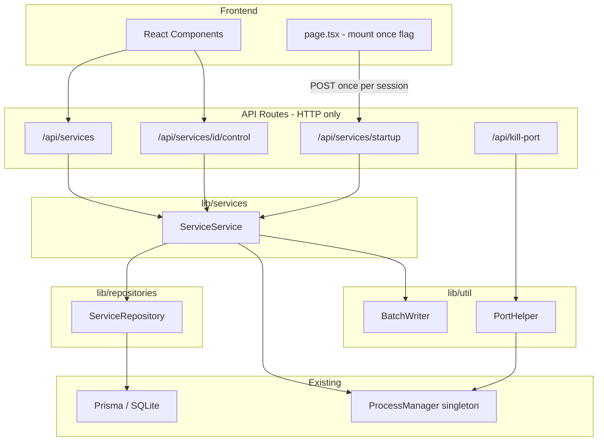
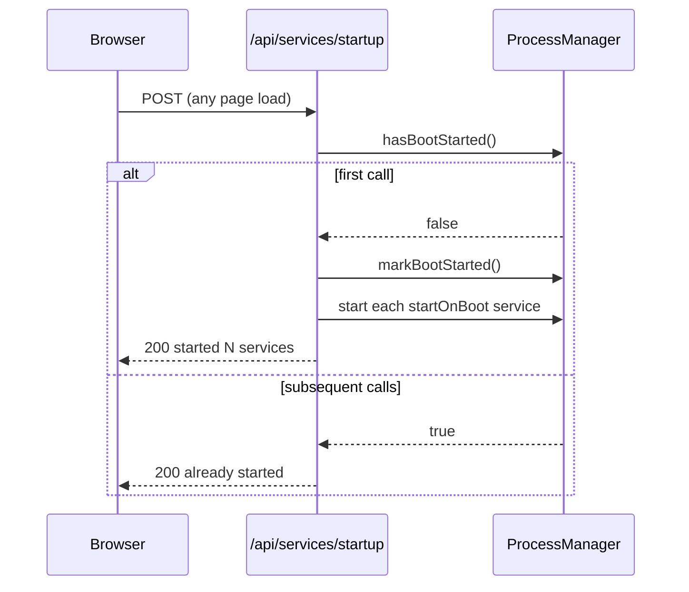
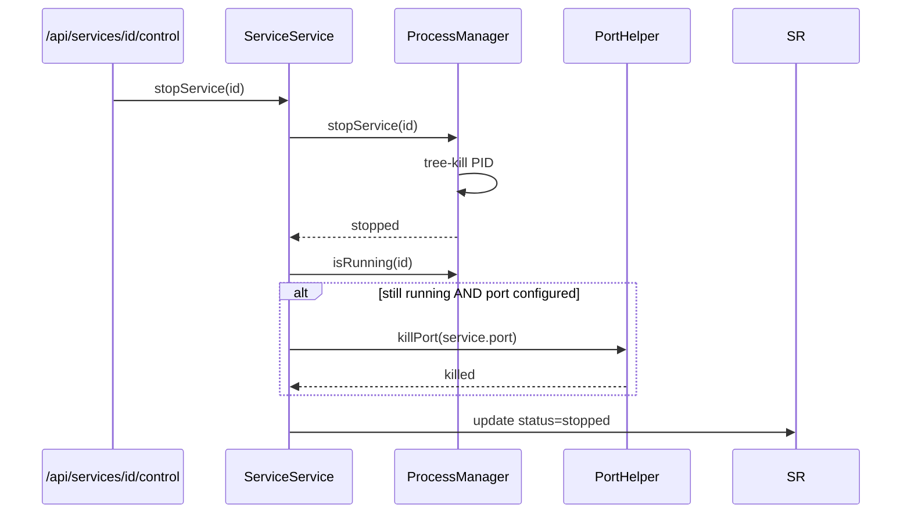

# TDD: Service Architecture Refactor + Port & CUDA Device Management

## Introduction

The service-manager app is a Next.js dashboard for managing long-running Windows processes (ComfyUI, llama.cpp, etc.). Currently all business logic lives directly in API route handlers alongside HTTP concerns, auto-start fires on every page load/reload, stop doesn't reliably kill auto-started processes, and there is no per-service port or CUDA device configuration.

This TDD covers five changes: (1) introducing a proper service/repository layer, (2) fixing auto-start to fire only once per server lifetime, (3) ensuring stop reliably terminates processes (including port-based kill as fallback), (4) adding a `port` field to the DB and UI exposed as `%PORT%`, and (5) adding a `cudaDevice` field exposed as `%CUDA_DEVICE%` in the batch script.

---

## Goals and Non-Goals

**Goals**
- Routes handle only HTTP parsing/response; zero business logic in route files
- Auto-start triggers once per server boot, not on page navigation or reload
- Stop always terminates the process (kill by PID, then kill by port as fallback)
- Each service has an optional `port` field stored in DB, exposed as `%PORT%` env var in the batch script
- Each service has an optional `cudaDevice` field stored in DB, exposed as `%CUDA_DEVICE%` env var in the batch script
- Port and CUDA Device fields are editable in AddServiceModal and EditServiceModal

**Non-Goals**
- Multi-port support per service
- Health check polling against the port
- Service dependency ordering
- Cross-platform support (Windows only)

---

## Problem Statement

| # | Pain Point | Impact |
|---|-----------|--------|
| 1 | Route files contain Prisma queries, process spawning logic, and response formatting mixed together | Hard to test, modify, or reuse logic |
| 2 | `useEffect` in `page.tsx` calls `/api/services/startup` on every mount — navigating away and back restarts services | ComfyUI unexpectedly restarts on page reload |
| 3 | When a service is auto-started and then manually stopped, the process continues running and logs appear | User has no reliable way to stop a service |
| 4 | No way to configure or inject the port a service listens on | User must hard-code ports in batch scripts |
| 5 | No way to configure or inject the CUDA device index | User must hard-code CUDA device in batch scripts |

---

## Architectural Overview



---

## Detailed Technical Sections

### Components and Interfaces

#### `lib/repositories/serviceRepository.ts`
Thin wrapper around Prisma — all DB access goes here.

```typescript
export interface ServiceRepository {
  findAll(): Promise<Service[]>
  findById(id: string): Promise<Service | null>
  create(data: CreateServiceInput): Promise<Service>
  update(id: string, data: UpdateServiceInput): Promise<Service>
  delete(id: string): Promise<void>
  findAutoStart(): Promise<Service[]>
}
```

#### `lib/services/serviceService.ts`
All business logic — orchestrates repository + ProcessManager.

```typescript
export interface ServiceService {
  listServices(): Promise<ServiceWithStatus[]>
  getService(id: string): Promise<ServiceWithStatus>
  createService(input: CreateServiceInput): Promise<Service>
  updateService(id: string, input: UpdateServiceInput): Promise<Service>
  deleteService(id: string): Promise<void>
  startService(id: string): Promise<void>
  stopService(id: string): Promise<void>
  restartService(id: string): Promise<void>
  runAutoStart(): Promise<AutoStartResult[]>
}
```

#### `lib/util/portHelper.ts`
Extracted from kill-port route — reusable by stopService as fallback.

```typescript
export async function killPort(port: number): Promise<{ killed: boolean; pids: number[] }>
export async function isPortListening(port: number): Promise<boolean>
```

#### `lib/util/batchWriter.ts`
Extracted from ProcessManager — writes temp batch files with env injection.

```typescript
export async function writeBatchFile(serviceId: string, command: string, env: Record<string, string>): Promise<string>
```

#### Database Schema Change

Add `port` field to `Service` model:

```prisma
model Service {
  id          String   @id @default(cuid())
  name        String
  description String?
  command     String
  startOnBoot Boolean  @default(false)
  port        Int?     // NEW: optional port number
  cudaDevice  String?  // NEW: optional CUDA device index e.g. "0", "1", "cuda1"

  pid         Int?
  status      String   @default("stopped")
  createdAt   DateTime @default(now())
  updatedAt   DateTime @updatedAt
}
```

Migration: `npx prisma migrate dev --name add_port_cuda_fields`

---

### Data Flows and Security

#### Auto-Start Fix — Fire Once Per Server Boot

**Current (broken):**
```
page.tsx useEffect → POST /api/services/startup  (fires every page mount)
```

**Fix — server-side flag in ProcessManager:**



`ProcessManager` gains a boolean `private bootStarted = false` (survives hot-reload via global singleton).

#### Stop + Port Fallback



#### Port Env Injection

When `startService` writes the temp batch file:

```batch
@echo off
set PORT=8080
set CUDA_DEVICE=1
<user command>
```

Both values are injected conditionally — only set lines are written for fields that are non-null:

```typescript
const env: Record<string, string> = {}
if (service.port)       env.PORT        = String(service.port)
if (service.cudaDevice) env.CUDA_DEVICE = service.cudaDevice
BW.writeBatchFile(id, command, env)
```

`cudaDevice` is stored as `String` (not `Int`) since values like `"cuda1"` are valid device identifiers in some frameworks.

#### Security Notes
- Port value is validated as integer (1–65535) before DB write — no injection possible
- `cudaDevice` is a free-form string but only written into a `set` statement — no shell expansion risk beyond existing batch content trust level
- Batch file content is user-supplied (same trust level as before) — no change to threat model
- Port kill fallback only triggers for the service's own configured port

---

## Alternatives Considered

| Option | Pros | Cons |
|--------|------|------|
| Keep logic in routes, just add port field | Minimal change | Doesn't fix architecture; tech debt grows |
| Move auto-start trigger to server startup (custom Next.js server) | No page-load dependency | Requires ejecting from default Next.js server; more complex |
| Store `bootStarted` in DB | Survives crashes | Must reset on startup; race conditions on first load |
| Health-check port to detect if service stopped | Accurate status | Polling adds overhead; services may not respond to health checks |

**Chosen:** Server-side boolean in ProcessManager singleton (already survives hot-reloads by design), with port-kill fallback on stop.

---

## Testing Strategy

Integration tests using real SQLite (test DB) + real ProcessManager. Favor end-to-end route tests over unit mocks.

### Test Cases

#### 1. Auto-Start Fires Only Once
```
POST /api/services/startup  → 200, N services started
POST /api/services/startup  → 200, "already started", 0 services started
Verify: ProcessManager.startService called exactly N times total
```

#### 2. Stop Kills by Port When PID Kill Fails
```
Create service with port=9999
Start service (mock PID that appears stuck)
POST /api/services/{id}/control { action: 'stop' }
Verify: isPortListening(9999) returns false after stop
Verify: service status in DB is 'stopped'
```

#### 3. Port Env Variable Injected into Batch
```
Create service with port=8080, command="echo %PORT%"
Start service
Read output buffer
Verify: output contains "8080"
```

#### 4. Service Layer Isolation
```
Call ServiceService.listServices()
Verify: returns array of ServiceWithStatus
Verify: no Prisma calls in route handler (route only calls ServiceService)
```

#### 5. Port Field CRUD
```
POST /api/services { name, command, port: 8080 } → 201, service.port === 8080
PUT  /api/services/{id} { port: 9090 } → 200, service.port === 9090
GET  /api/services/{id} → 200, port field present
```

#### 6. Invalid Port Rejected
```
POST /api/services { port: 99999 } → 400
POST /api/services { port: -1 }    → 400
POST /api/services { port: null }  → 201, port is null (optional)
```

#### 7. CUDA Device Env Variable Injected into Batch
```
Create service with cudaDevice="1", command="echo %CUDA_DEVICE%"
Start service
Read output buffer
Verify: output contains "1"
```

#### 8. CUDA Device Field CRUD
```
POST /api/services { name, command, cudaDevice: "cuda1" } → 201, service.cudaDevice === "cuda1"
PUT  /api/services/{id} { cudaDevice: "0" }               → 200, service.cudaDevice === "0"
GET  /api/services/{id}                                    → 200, cudaDevice field present
```
