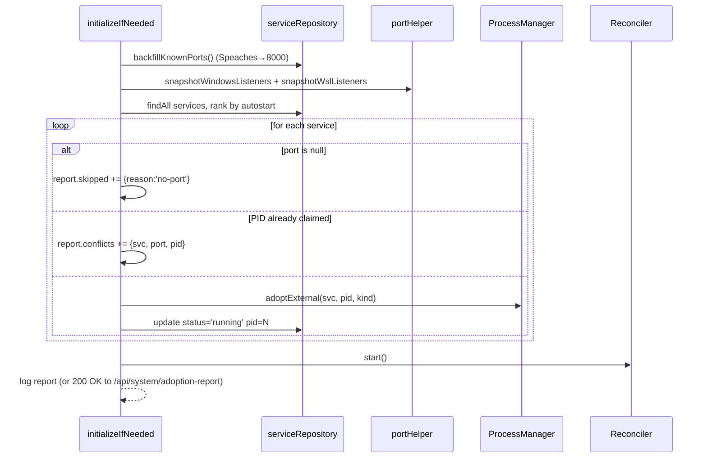
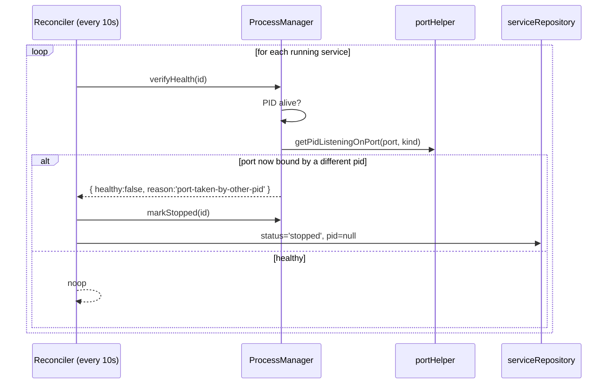
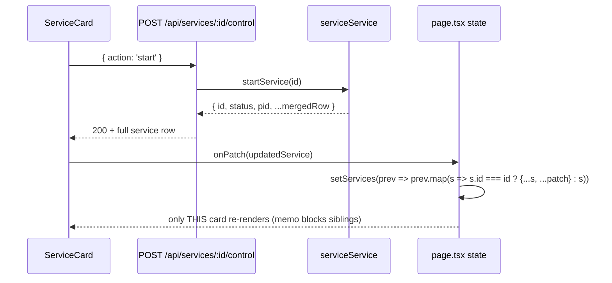

# TDD v2: Reliable Adoption, Port-Collision Safety, Granular Refresh, Safe Tests

> This is the follow-up to `tdd-only-restart-diff.md`. The v1 work shipped the diff-driven profile switch, port-based adoption, file-backed log tailing, and the dnd/collapse UI — but in real use it produced a cascade of failure modes (incorrect state, port-collision adoption, error-without-port for Speaches, orphaned Node processes that forced a full computer restart). This document defines what has to change to make the feature reliable, and lays out a test strategy that **cannot** leak processes.

---

## Introduction

The v1 implementation made three implicit assumptions that turned out to be wrong on this machine:

1. **One service per port.** Adoption matches PID-by-port. The DB has both `vllm` and `Llama.cpp Server` configured for port `8080`. When `adoptRunningServices` runs, the same PID is adopted by *both* services. Symptom: `vllm` is shown as running with a PID that may not be vllm; `Llama.cpp Server` is shown as running even though it is `startOnBoot=false`.
2. **The DB has correct ports.** `Speaches STT & TTS` has `port=NULL` (uvicorn defaults to 8000, but service-manager doesn't know that). Adoption skips it (`if (!svc.port) continue`), the spawn path passes no `PORT` env, and the service ends up in `error` because something else (or its own prior incarnation) already occupies 8000.
3. **Singletons are safe in dev.** `ProcessManager` and `LogTailer` are stored on `globalThis`. Next.js hot-reload + jest singletons leak intervals, spawned `cmd.exe` children, and `wsl.exe` invocations. Across a long debugging session this produced ~2,700 zombie `node.exe` processes that maxed RAM and forced a hard reboot.

The fix is not a tweak — it's a re-grounding of three things: **how we identify a real process on a port**, **how the UI updates after an action**, and **how tests touch the real system**. Everything else is downstream of those three.

---

## Goals and Non-Goals

**Goals**

- Adoption never assigns the same PID to two services.
- Services with no `port` are either configured with one (Speaches → 8000) or are explicitly opted out of adoption — never silently silenced.
- Running-state in the UI reflects a *health-probed* truth: the PID is alive **and** the configured port is bound by that PID.
- A power-button toggle (or any per-service action) updates only that card; sibling cards do not re-render, do not refetch output, and do not flicker.
- `npm test` runs to completion without leaving a single child process behind. A pre/post invariant guard fails the suite if process count grows.
- Test runs are safe to invoke repeatedly without rebooting the machine.

**Non-Goals**

- Multiple processes legitimately sharing a port (e.g. SO_REUSEPORT). We assume 1 process : 1 port.
- Distinguishing between two services whose configs are *identical* (same command + port + cuda). If you intentionally do this, only one will adopt.
- Authenticated health probes per service. v1 uses TCP-connect; per-service `/health` paths are a follow-up.
- Cleaning up the 2,700 leaked processes from the last session — that's a one-off operational task, not part of this design.

---

## Problem Statement (with file references)

### P1. Port-collision adoption assigns the same PID to multiple services

`src/lib/services/init.ts:32` — `adoptRunningServices` walks every service and looks up its port in the snapshot map. The map is *port → PIDs*, and the function does not track which services have already claimed which PID. Two services on port 8080 both adopt PID 5196.

### P2. Adoption is silently skipped for services with `port=NULL`

`src/lib/services/init.ts:41` — `if (!svc.port) continue`. This is the right safety, but the consequence isn't reported anywhere. The user has no idea Speaches was skipped. Combined with the fact that the spawn script doesn't pass `PORT` when port is unset, the service can land on a default port that another service is already bound to — and we never adopt it.

### P3. `processManager.isRunning` lies after a PID dies between polls

`src/lib/process-manager.ts:314` — `isRunning` for a Windows-adopted PID does `process.kill(pid, 0)`. That returns truthy as long as the PID exists. But:
- the PID could be a different process that recycled the number (Windows recycles PIDs aggressively);
- the PID could be alive but not actually serving on the port (model failed to load, port already freed);
- the PID can disappear *between* the `isRunning` check and the next render — in v1 there is no port re-check.

For WSL-adopted services, `isRunning` returns `true` unconditionally (`src/lib/process-manager.ts:320`) — no probe at all. A WSL process that crashed five seconds ago still appears green.

### P4. Power-button action causes a full grid re-render

`src/components/ServiceCard.tsx:51` — after the control POST returns, `onRefresh()` (page.tsx:78 `fetchServices`) refetches **all** services and replaces `services` with a brand-new array. Every `SortableServiceCard` re-renders; every child `<TerminalOutput>` re-mounts; each card's 1-second output poll is restarted. To the user this is indistinguishable from a page refresh. The other cards also flicker their PID/status if the 2s background poll completes mid-render.

### P5. `LogTailer` and `ProcessManager` leak across hot reloads

`src/lib/process-manager.ts:23-43` and `src/lib/util/logTailer.ts:20-38` both use the `globalThis` + `instanceof` trick. It catches the case where the class is redefined, but it does **not** clean up:
- `cmd.exe` / `powershell.exe` children spawned by the prior instance (their PIDs are stored on the old `processes` map, which is garbage-collected — the children become orphans);
- `wsl.exe` invocations from `snapshotWslListeners` that exec'd before the reload landed;
- The `setInterval` handles on the old LogTailer (the v1 code does attempt this via `(existing as any).tailers?.values?.()`, but it can't reach handles for tailers added *after* the snapshot ran).

There's no `process.on('SIGTERM' | 'SIGINT' | 'exit', cleanup)` anywhere.

### P6. Tests touch the real `processManager` singleton

`src/__tests__/adoption.test.ts` writes directly into `(processManager as any).processes`. There is no `beforeEach` that resets the singleton. A failed assertion mid-suite leaves state in the module. Jest's `--maxWorkers` defaults mean the same module is re-imported in worker processes, but the same workers re-running between watch-mode invocations accumulate state.

### P7. Diff result is not surfaced to the user

`src/lib/services/runProfileService.ts:93` builds a `results` array, but page.tsx:142 just refetches profiles and services on switch. The user can't tell whether `vllm` was kept running or restarted, and silent failures in the loop (try/catch swallows + `results.push({ status: 'error' })`) never appear.

---

## Architectural Overview

```mermaid
graph TD
    subgraph "Truth Layer (new)"
        PortMap["snapshotAllListeners()"]
        HealthProbe["healthProbe(svc)<br/>PID alive + port bound by THIS pid"]
        Reconcile["reconcileServiceState()<br/>single source: probe → DB → UI"]
    end

    subgraph "Boot"
        Init["initializeIfNeeded"] --> Adopter["adoptRunningServices<br/>(1:1 PID→service)"]
        Adopter --> PortMap
        Adopter --> Claim["claimedPids: Set"]
    end

    subgraph "Runtime"
        ListSvc["listServices"] --> Reconcile
        Reconcile --> HealthProbe
        TogglePower["control endpoint"] -->|returns updated svc only| UI
    end

    subgraph "UI"
        UI["page.tsx grid"]
        Card["ServiceCard"]
        UI -->|setServices(prev => map)| Card
    end

    subgraph "Lifecycle"
        Shutdown["SIGTERM/SIGINT handler"] --> KillChildren["kill all spawned children"]
        KillChildren --> StopTailers["stop all log tailers"]
    end

    subgraph "Tests"
        TestHarness["test-harness.ts<br/>(beforeEach reset)"]
        ProcessGuard["pre/post process count guard"]
        TestHarness --> ProcessManager["fresh ProcessManager"]
    end
```

---

## Detailed Technical Sections

### 1. Adoption: 1 PID ↔ 1 service

#### 1a. Claim-tracking pass

`adoptRunningServices` (src/lib/services/init.ts:32) becomes:

```typescript
async function adoptRunningServices(): Promise<AdoptionReport> {
  const [winMap, wslMap] = await Promise.all([
    snapshotWindowsListeners(),
    snapshotWslListeners(),
  ])
  const services = await serviceRepository.findAll()

  const claimed = new Set<string>()  // "windows:pid" | "wsl:pid"
  const report: AdoptionReport = { adopted: [], conflicts: [], skipped: [] }

  // Sort services so that the active profile's autostart services adopt first.
  // Without this, alphabetical order wins port collisions arbitrarily.
  const active = await runProfileRepository.findActive()
  const ranked = await rankByAutostartPriority(services, active?.id)

  for (const svc of ranked) {
    if (!svc.port) { report.skipped.push({ id: svc.id, reason: 'no-port' }); continue }
    if (processManager.isRunning(svc.id)) continue

    const winPid = winMap.get(svc.port)?.[0]
    const wslPid = wslMap.get(svc.port)?.[0]

    const candidate =
      winPid !== undefined ? { kind: 'windows' as const, pid: winPid }
      : wslPid !== undefined ? { kind: 'wsl' as const, pid: wslPid }
      : null

    if (!candidate) continue

    const key = `${candidate.kind}:${candidate.pid}`
    if (claimed.has(key)) {
      report.conflicts.push({ serviceId: svc.id, port: svc.port, pid: candidate.pid })
      continue   // do NOT adopt — another service already owns this PID
    }
    claimed.add(key)

    processManager.adoptExternal(svc.id, candidate.pid, candidate.kind)
    await serviceRepository.update(svc.id, { status: 'running', pid: candidate.pid })
    report.adopted.push({ serviceId: svc.id, pid: candidate.pid, kind: candidate.kind })
  }

  return report
}
```

`AdoptionReport` is logged to the server console (and exposed via `GET /api/system/adoption-report` for the UI to display a banner if conflicts exist). Conflicts surface to the user — they're a misconfiguration, not a silent bug.

#### 1b. Autostart priority for port conflicts

```typescript
async function rankByAutostartPriority(services: Service[], activeProfileId: string | undefined): Promise<Service[]> {
  if (!activeProfileId) return services
  const autostart = new Set(
    (await runProfileRepository.findAutoStartServices(activeProfileId)).map(e => e.serviceId)
  )
  return [...services].sort((a, b) => Number(autostart.has(b.id)) - Number(autostart.has(a.id)))
}
```

This makes the active profile's intent the tiebreaker: if `vllm` is autostart and `Llama.cpp Server` is not, the PID on 8080 goes to `vllm`. `Llama.cpp Server` then shows as `stopped` (because it's not adopted *and* `startOnBoot=false`).

#### 1c. Validate port uniqueness at write time

`serviceService.createService` and `updateService` (src/lib/services/serviceService.ts:85, 102) add a soft-warning check: if another service has the same `port`, return a `409 Conflict` unless the request body contains `allowPortCollision: true`. This catches the misconfiguration at the source — not after a reboot.

### 2. Speaches and other port-less services

Two-part fix:

#### 2a. Migration: backfill known ports

A one-shot Prisma migration (or seed script at first run) sets the Speaches `port` to `8000` if it is currently `NULL`. The script logs what it changed so the user can verify.

```typescript
// src/lib/services/init.ts — runs once inside ensureDefaultProfile
async function backfillKnownPorts(): Promise<void> {
  const KNOWN = {
    'Speaches STT & TTS': 8000,
    // add more as they are discovered
  }
  for (const [name, port] of Object.entries(KNOWN)) {
    const svc = await serviceRepository.findByName(name)
    if (svc && svc.port == null) {
      await serviceRepository.update(svc.id, { port })
      console.log(`[init] backfilled port=${port} for "${name}"`)
    }
  }
}
```

#### 2b. UI surfaces port-less services as a warning, not silence

`ServiceCard` shows an inline yellow chip `⚠ no port — won't auto-adopt` when `port == null`. The user can click into Edit and set it. The chip is hidden once a port is set.

### 3. Health-probed `isRunning`

Replace the PID-only check with a two-stage probe:

```typescript
// src/lib/process-manager.ts
isRunning(serviceId: string): boolean {
  const proc = this.processes.get(serviceId)
  if (proc?.status !== 'running') return false
  // For spawned (process !== null) children: trust the OS via .killed/.exitCode
  if (proc.process && proc.process.exitCode === null && !proc.process.killed) return true
  // For adopted PIDs: PID-alive check (cheap, synchronous)
  if (proc.pid && !this.isProcessRunning(proc.pid)) {
    proc.status = 'stopped'; proc.pid = undefined
    return false
  }
  return true
}
```

For deeper truth (port still bound by *this* PID), add a separate async method `verifyHealth(serviceId)` that the *reconciler* (see §4) calls — not the per-request `isRunning` hot path. Probing TCP on every render would be expensive.

```typescript
async verifyHealth(serviceId: string): Promise<{ healthy: boolean; reason?: string }> {
  const proc = this.processes.get(serviceId)
  if (!proc || proc.status !== 'running' || !proc.pid) return { healthy: false, reason: 'not-running' }
  const port = await serviceRepository.getPort(serviceId)
  if (!port) return { healthy: true }   // can't probe, trust PID check

  const listenerPid = await getPidListeningOnPort(port, proc.adoption ?? 'windows')
  if (listenerPid === undefined) return { healthy: false, reason: 'port-not-bound' }
  if (listenerPid !== proc.pid) return { healthy: false, reason: 'port-taken-by-other-pid' }
  return { healthy: true }
}
```

`verifyHealth` runs in a single background pass every ~10s (not per-request) and reconciles status. This catches:
- vllm marked running with PID 5196, but PID 5196 is now node.exe → flipped to `error: port-taken-by-other-pid`.
- vllm marked running, PID 5196 alive, but nothing on port 8080 → flipped to `error: port-not-bound`.

### 4. Reconciler: single source of truth

```typescript
// src/lib/services/reconciler.ts (new)
class Reconciler {
  private interval?: NodeJS.Timeout

  start(): void {
    if (this.interval) return
    this.interval = setInterval(() => this.tick(), 10_000)
    // Run once immediately so the UI doesn't lag 10s behind on boot.
    void this.tick()
  }

  stop(): void {
    if (this.interval) clearInterval(this.interval)
    this.interval = undefined
  }

  private async tick(): Promise<void> {
    const services = await serviceRepository.findAll()
    for (const svc of services) {
      const mem = processManager.getStatus(svc.id)
      if (!mem || mem.status !== 'running') continue
      const result = await processManager.verifyHealth(svc.id)
      if (!result.healthy) {
        await processManager.markStopped(svc.id, /*reason*/ result.reason)
        await serviceRepository.update(svc.id, { status: 'stopped', pid: null })
      }
    }
  }
}
```

`initializeIfNeeded` starts the reconciler after adoption. Shutdown hooks stop it (see §6).

### 5. Granular UI updates

#### 5a. Control endpoint returns the updated service

`POST /api/services/:id/control` already returns `{ id, status, pid }`. Extend it to return the full service row (with merged profile overrides), and have the page state apply a single-card patch:

```typescript
// page.tsx
function applyServicePatch(patch: Service) {
  setServices(prev => prev.map(s => s.id === patch.id ? { ...s, ...patch } : s))
}
```

`ServiceCard` calls a new prop `onPatch(patch)` instead of `onRefresh()`. The 2-second background `fetchServices` poll still runs but now uses a stable merge (only replace fields that changed; preserve referential equality for unchanged cards so React.memo can short-circuit).

#### 5b. Memo + key stability

`SortableServiceCard` becomes `React.memo` with a custom comparator that returns true when the service's `status`, `pid`, `port`, `command`, `cudaDevice`, `startOnBoot`, `name`, `description` are equal. The terminal output is fetched inside the card itself; the parent passing `service` doesn't need to retrigger it.

#### 5c. Decouple output polling from card identity

The 1-second `fetch /api/services/:id/output` poll lives in `ServiceCard.useEffect` keyed only on `service.id`. After memoization, the effect doesn't re-run when sibling cards update.

### 6. Lifecycle hooks: never leak children again

A new module `src/lib/lifecycle.ts`:

```typescript
let installed = false
const handlers: Array<() => Promise<void> | void> = []

export function onShutdown(fn: () => Promise<void> | void): void {
  handlers.push(fn)
  if (!installed) install()
}

function install(): void {
  installed = true
  const fire = async (signal: string) => {
    console.log(`[lifecycle] received ${signal}, running ${handlers.length} cleanup handlers`)
    await Promise.allSettled(handlers.map(h => h()))
    process.exit(0)
  }
  process.once('SIGINT', () => void fire('SIGINT'))
  process.once('SIGTERM', () => void fire('SIGTERM'))
  process.once('beforeExit', () => void fire('beforeExit'))
}
```

`ProcessManager` registers a handler that calls `treeKill` on every spawned child's `process.pid` and `killWslPids` on every WSL-adopted PID **that the user has opted into killing on exit** (default: only kill *spawned* children; do not kill *adopted* PIDs — they were running before us and should outlive us).

`LogTailer` registers a handler that clears every interval and empties its map.

`Reconciler` registers a handler that clears its interval.

This means a clean `Ctrl+C` on `npm run dev` reliably stops any cmd.exe/powershell.exe children that service-manager spawned, instead of leaving them as orphans.

> Hot-reload caveat: Next.js hot-reload does not fire `SIGTERM` on the module. The `globalThis` `instanceof` trick still has to do the cleanup work for HMR. Extend it to also run all registered shutdown handlers when an instance is replaced:
>
> ```typescript
> if (!existing || !(existing instanceof ProcessManager)) {
>   if (existing) (existing as any).hmrCleanup?.()   // best-effort sync cleanup
>   globalForProcessManager.processManagerInstance = new ProcessManager()
> }
> ```

### 7. Test strategy that cannot leak

#### 7a. Process-count invariant guard

`src/__tests__/setup/processGuard.ts`:

```typescript
import { execSync } from 'child_process'

function countNodeProcesses(): number {
  try {
    const out = execSync('powershell -NoProfile -Command "(Get-Process node -EA SilentlyContinue).Count"').toString().trim()
    return parseInt(out) || 0
  } catch { return 0 }
}

let baseline = 0

beforeAll(() => { baseline = countNodeProcesses() })
afterAll(() => {
  const after = countNodeProcesses()
  const delta = after - baseline
  if (delta > 2) {
    console.error(`[processGuard] FAIL: leaked ${delta} node processes (was ${baseline}, now ${after})`)
    // Don't throw — let Jest report the suite result first — but mark the run as a failure.
    process.exitCode = 1
  }
})
```

Wired into `jest.config.ts` as a global `setupFilesAfterEach`. The threshold (2) accounts for Jest's own worker delta.

#### 7b. ProcessManager test factory — never touch the singleton

Replace direct mutation of `(processManager as any).processes` with a factory:

```typescript
// src/__tests__/setup/makeProcessManager.ts
export function makeTestProcessManager(): ProcessManager {
  // Returns a brand-new instance bypassing the globalThis cache.
  return Reflect.construct(ProcessManager as any, [])
}
```

Every test that previously imported `processManager` from `@/lib/process-manager` imports `makeTestProcessManager` instead, gets a fresh instance per `beforeEach`, and calls its `hmrCleanup()` in `afterEach`. The real singleton is never written to during tests.

#### 7c. Real-port tests run in a worker and own the cleanup

For the few tests that genuinely need a real OS port (currently in `adoption.test.ts`):

- A single test file (`adoption.realport.test.ts`) opens **one** http server in `beforeAll`, runs all assertions against it, closes it in `afterAll` with `await new Promise(r => server.close(r))`.
- The test file is in its own Jest `projects` entry so it runs serially (`maxWorkers: 1`).
- A `try { ... } finally { server.close() }` wrapper around the test body guarantees cleanup even on assertion failure.

#### 7d. WSL test gating

Tests that touch WSL set `if (!wslAvailable) return` (already done). Add an additional guard: do not actually `kill -9` anything; the WSL kill paths are tested with a *fake* PID + mock `execFile` so we never accidentally kill the user's running llama.cpp.

#### 7e. Forbid `processManager.startService` in tests

A lint rule (or a `beforeEach` that monkey-patches `startService` to throw) ensures no test ever spawns a real `cmd.exe`. Spawning is exercised only via a single integration test that uses a known-trivial command (`cmd.exe /c echo hello & exit`), wrapped in a `withSpawnedProcess(cb)` helper that *guarantees* the child is killed before the test returns.

```typescript
async function withSpawnedProcess<T>(pm: ProcessManager, id: string, cb: () => Promise<T>): Promise<T> {
  try {
    return await cb()
  } finally {
    if (pm.isRunning(id)) await pm.stopService(id).catch(() => {})
    // Failsafe: force-kill by pid
    const pid = pm.getPid(id)
    if (pid) { try { process.kill(pid, 'SIGKILL') } catch {} }
  }
}
```

#### 7f. Jest config defaults

```jsonc
// jest.config.ts
{
  detectOpenHandles: true,
  forceExit: true,
  testTimeout: 10_000,            // fail fast instead of hanging
  maxWorkers: '50%',
  globalTeardown: './src/__tests__/setup/globalTeardown.ts',
}
```

`globalTeardown.ts` runs `killWindowsPidsExceeding(baseline)` — only as a last resort if `processGuard` reports a delta.

---

## Data Flows

### Boot: adoption with claim tracking



### Reconcile tick



### Single-card update after power toggle



---

## Risks

| Risk | Mitigation |
|---|---|
| Claim-tracking changes order-of-operations: a service that previously adopted may now be skipped | Adoption report surfaces the new conflicts in the UI; user fixes the duplicate port. Migration logs all conflicts on first boot. |
| `verifyHealth` adds load (one `netstat` per service every 10s) | Reuse the `snapshotWindowsListeners` map — one OS call per tick, not per service. Cache for 10s. |
| Backfilling Speaches port to 8000 collides with the user's actual setup if they remapped it | Only backfill when `port == null` (not when it's set to a different value). Log the change so the user can override. |
| Memo comparator misses a field added later (e.g. new `health` field) → stale UI | Comparator is a single function; adding a field is one-line. Add a Storybook test or RTL `rerender` assertion that exercises every field. |
| Lifecycle handler runs but children survive on Windows because tree-kill is async | `await Promise.allSettled(handlers)` before `process.exit(0)` gives each handler up to its own internal timeout (5s as today). |
| Process-count guard false-positives on shared CI runners | Threshold is a delta (after − before), not absolute. Two-process buffer absorbs Jest worker variance. |
| HMR cleanup is best-effort sync; some spawned cmd.exe survives a save | Document that `npm run dev` should be Ctrl+C'd before heavy testing; the lifecycle handler catches that case cleanly. HMR-survivors are rare and bounded (1 per save × number of services in flight). |

---

## Alternatives Considered

| Decision | Option | Pros | Cons |
|---|---|---|---|
| **Port collision resolution** | First-come-first-adopt (v1) | Simple | Non-deterministic; user can't reason about it |
| | **Autostart-priority + claim tracking (chosen)** | Honors user intent; surfaces conflicts | More state to carry through adoption |
| | Refuse to adopt any port shared by 2+ services | Maximally safe | Forces user to fix data before any adoption works |
| **Speaches port** | Make port required (NOT NULL) at the schema level | Forces correctness | Migration breaks existing data |
| | **Backfill known defaults + UI warning chip (chosen)** | Fixes today's pain, allows future port-less services | Hidden coupling between code and service name |
| **Health probe** | Per-service `/health` HTTP GET | Strongest truth | Each service needs a configured health URL |
| | **PID + port-binding check (chosen)** | Works for every service without config | Doesn't catch "process bound but model failed to load" |
| **UI granularity** | Replace polling with SSE on `processManager.emit('status-change')` | True push, no flicker | Larger refactor; SSE in Next.js app router has gotchas |
| | **Memo + single-card patch (chosen)** | Small diff; uses existing API surface | Still polls every 2s in the background |
| **Test isolation** | Run each test file in its own process | Maximally safe | Slow; Jest already does workers |
| | **Factory + processGuard (chosen)** | Catches leaks without slowing tests | Requires discipline in test authors |

---

## Testing Strategy

### Unit (pure)

`src/__tests__/adoptionClaimTracking.test.ts`

```
describe('adoptRunningServices port-collision handling')
  it('assigns a colliding PID to the autostart service, not the other')
  it('reports the second service in the conflicts array')
  it('does not call adoptExternal twice for the same PID')
  it('treats windows:5196 and wsl:5196 as different claims')

describe('rankByAutostartPriority')
  it('returns autostart services before non-autostart')
  it('returns input order unchanged when no active profile')
```

`src/__tests__/reconciler.test.ts`

```
describe('Reconciler.tick')
  it('flips a service from running to stopped when port is no longer bound')
  it('flips a service from running to stopped when port is bound by a different pid')
  it('leaves healthy services alone')
  it('uses a single port-snapshot per tick (not one per service)')
```

### Integration (mocked ProcessManager via factory)

`src/__tests__/integration/profileSwitch.test.ts`

```
describe('switchProfile with port-collision configuration')
  it('does not surface vllm as running when llama.cpp adopted PID 8080 first')
  it('reports the conflict to the caller')
```

### Real-OS (gated, serial, with cleanup)

`src/__tests__/realport/adoption.realport.test.ts` — same as v1's `adoption.test.ts` but:

- single http server reused across all assertions (one open / one close)
- runs in `projects: [{ testMatch: '*.realport.*', maxWorkers: 1 }]`
- `processGuard` asserts no leak

`src/__tests__/realport/spawned.realport.test.ts`

```
describe('spawning a trivial process')
  it('startService runs to completion when command is `cmd.exe /c exit 0`')
  it('stopService kills a running `cmd.exe /c pause` and the PID is gone')
  it('does NOT leave the child cmd.exe behind on test failure (try/finally guard)')
```

### Component (RTL)

`src/components/__tests__/ServiceCard.memo.test.tsx`

```
describe('ServiceCard memoization')
  it('does not re-render when an unrelated sibling service updates')
  it('re-renders when its own service.status changes')
  it('does not re-render when the parent reference changes but values are equal')
```

### E2E (Playwright)

`e2e/granular-update.spec.ts`

```
test('clicking the power button only updates that card', async ({ page }) => {
  // 1. Open the app, snapshot the DOM of card B and card C
  // 2. Click power on card A
  // 3. Wait for card A status to change
  // 4. Assert card B and card C DOM nodes are === to their snapshot
  //    (no re-mount, no flicker)
})

test('Llama.cpp Server does not appear running when vllm owns port 8080', async ({ page }) => {
  // 1. Configure vllm autostart=true port=8080
  // 2. Configure llama.cpp autostart=false port=8080
  // 3. Reload page
  // 4. Assert vllm shows running, llama.cpp shows stopped
})

test('Speaches has a port after backfill and adopts on boot', async ({ page }) => {
  // 1. With Speaches port=8000 in DB
  // 2. Start uvicorn manually outside the app
  // 3. Reload page
  // 4. Assert Speaches shows running with the manual PID
})
```

### Manual smoke (last line of defense)

After every PR, the human runs:

1. `npm test` — guard asserts < 2 process delta.
2. `npm run dev` → wait for app, observe every service has correct status; conflicts banner appears for any duplicate-port misconfig.
3. Toggle one service's power. Observe: only that card re-renders; no flicker on other cards.
4. Ctrl+C the dev server. Run `Get-Process node`. Count must be roughly `pre-start count + 0`.
5. Repeat (2)–(4) three times in a row; cumulative count growth must be < 5.

The manual step (4) is the canary that catches lifecycle regressions before they compound into the 2,700-process crash.

---

## Out of Scope (Follow-ups)

- Per-service `/health` URL probes (replaces TCP-bind check for HTTP services).
- Database-backed UI order/collapse persistence (currently localStorage).
- A "kill all orphans" admin button in the UI (one-off cleanup tool).
- Sub-second UI updates via SSE on `processManager.emit('status-change')`.

---

## Open Questions for the Reviewer

1. **Speaches port**: 8000 is the uvicorn default, but the existing `.bat` runs without `--port`. Is there a profile where you intentionally want it on a different port? If so, list them so the backfill skips them.
2. **vllm vs llama.cpp port 8080**: Should the diff/UI also offer an automatic remediation ("move llama.cpp to 8081")? Or just surface the conflict?
3. **Reconciler tick interval**: 10s feels right for desktop dev; too slow for production. Acceptable for v2?
4. **Adopted-PID cleanup on Ctrl+C**: Default is "don't kill adopted PIDs because they pre-existed us." Confirm — or do you want a UI option to kill on exit?
