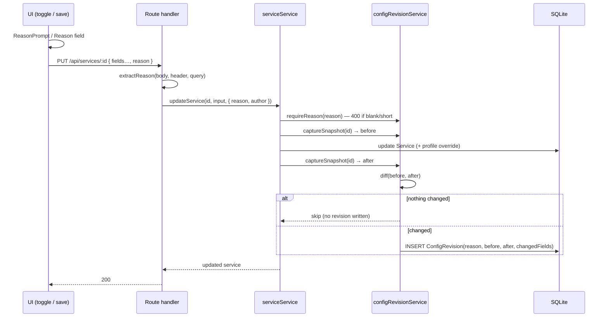

# task-1523 — Service Manager Change Log (reasoned config changes + revision history)

## Introduction

Service Manager is the single place every service on this box is configured: start commands, ports,
GPU pins, WSL flags, auto-start. Those configs are edited constantly — by Jason in the UI and by
agents over the REST API — and today a change leaves **no trace**. The row is overwritten in SQLite,
the previous command is gone, and nothing anywhere records *why* a flag was flipped. When a service
later misbehaves there is no way to answer "what changed, when, and what were we trying to do?", and
no way to put the old config back other than reconstructing it from memory.

This task makes every configuration change **explain itself and be undoable**: a `reason` becomes a
required input on every config mutation (create / update / delete / profile override), each change
writes an immutable `ConfigRevision` row holding the reason plus a full before/after snapshot, the
service's settings modal grows a **History** tab that expands a revision to show its reasoning and
config, and any revision can be **reverted** — as a new forward change that itself carries a reason.

## Goals and Non-Goals

### Goals

| # | Goal | Measurable outcome |
|---|---|---|
| G1 | No config change without a reason | `POST /api/services`, `PUT /api/services/:id`, `DELETE /api/services/:id`, `PUT /api/profiles/:id/services/:serviceId` reject a missing/blank/too-short reason with **400** and a message naming the field |
| G2 | Every accepted config change is recorded | One `ConfigRevision` row per accepted mutation, with reason, author, before + after snapshots and a computed changed-field list |
| G3 | History is visible per service | Settings modal has a **History** tab; each row expands to reason, author, timestamp, changed fields, and the full config at that point |
| G4 | Any revision can be restored | "Revert to this config" applies the snapshot and records a **new** revision (`changeType: 'revert'`, `revertedFromRevisionId`) — history is append-only |
| G5 | Pre-existing services are not blank | A one-time **baseline** revision is backfilled for every service that has no history |
| G6 | Agents are told to supply reasoning | The `service-manager` Claude skill documents `reason` as required on every mutating call and shows it in every example |

### Non-Goals

- **Lifecycle actions are not config changes.** start / stop / restart / kill-port / clear-output
  need no reason and write no revision. They already narrate themselves in the service's output.
- **Internal status writes** (`status`, `pid` from the process manager, adoption, reconciler) are not
  revisions — they are runtime state, not configuration.
- No global "all services" change-log page (the ticket scopes the UI to the settings section's tab).
- No un-delete. A deleted service's revisions are retained for audit, but restoring a deleted
  service is out of scope.
- No profile-level history (creating/renaming/switching profiles). Per-service config only.

## Problem statement

Current state, from the code:

- `serviceService.updateService()` writes straight through `serviceRepository.update()` to the
  `Service` row. The prior values are overwritten in place; nothing is retained.
- `runProfileService.upsertServiceOverride()` does the same for the profile-scoped fields
  (`cudaDevice`, `startOnBoot`).
- `ServiceCard`'s WSL / No-port / Auto-start buttons fire a `PUT` on a single click — the cheapest
  possible way to change behaviour, with the least possible context recorded.
- The GPU-pin work (task-1493) added *runtime* explanations into the service log (`appendServiceNote`)
  but nothing about *configuration* intent, and log tails roll over.

Impact: after an incident the only way to know a command changed is to notice it looks different.
Debugging "this used to work" means re-deriving a config that already existed. And because agents
edit these rows too, a change can appear with no human context at all.

## Architectural Overview

```mermaid
flowchart TD
  subgraph UI[Service Manager UI]
    Card[ServiceCard quick toggles]
    Edit[EditServiceModal - Settings tab]
    Hist[EditServiceModal - History tab]
    Reason[ReasonPrompt modal]
  end

  subgraph API[Next.js route handlers]
    PS[POST /api/services]
    PU[PUT /api/services/:id]
    DE[DELETE /api/services/:id]
    PO[PUT /api/profiles/:id/services/:serviceId]
    RL[GET /api/services/:id/revisions]
    RV[POST /api/services/:id/revisions/:revisionId/revert]
  end

  subgraph SVC[Service layer]
    SS[serviceService]
    RPS[runProfileService]
    CRS[configRevisionService]
  end

  subgraph DB[(SQLite via Prisma)]
    S[Service]
    RPSvc[RunProfileService]
    CR[ConfigRevision]
  end

  Card --> Reason --> PU
  Edit --> PU
  Edit --> PO
  Edit --> DE
  Hist --> RL
  Hist --> Reason
  Reason --> RV

  PS --> SS
  PU --> SS
  DE --> SS
  PO --> RPS
  RL --> CRS
  RV --> CRS

  SS --> CRS
  RPS --> CRS
  SS --> S
  RPS --> RPSvc
  CRS --> CR
  CRS -->|reads effective config| S
  CRS -->|reads effective config| RPSvc
```

Everything funnels through **one** recorder, `configRevisionService`, which owns three things: reason
validation, effective-config snapshotting, and the append-only write. No route handler writes a
revision itself, so there is no path that mutates config without one.

## Detailed Technical Sections

### Data model

```prisma
model ConfigRevision {
  id            String   @id @default(cuid())
  /// Not a relation on purpose: a deleted service's audit trail must survive the delete.
  serviceId     String
  /// Denormalised so a revision still reads sensibly after a rename/delete.
  serviceName   String
  profileId     String?
  profileName   String?
  /// create | update | delete | revert | baseline
  changeType    String
  /// ui | agent | api  — who made the change (best-effort, from the request).
  author        String   @default("ui")
  reason        String
  /// Effective config AFTER the change (JSON). Null only for a delete.
  snapshot      String?
  /// Effective config BEFORE the change (JSON). Null for create/baseline.
  previous      String?
  /// [{ field, from, to }] computed at write time so the UI never re-diffs.
  changedFields String   @default("[]")
  /// Set when this revision was produced by reverting an earlier one.
  revertedFromRevisionId String?
  createdAt     DateTime @default(now())

  @@index([serviceId, createdAt])
}
```

**Why no foreign key.** A `Service` relation with `onDelete: Cascade` would erase exactly the history
you want most — the record of a service being removed and what it looked like. The revision keeps a
plain `serviceId` string plus the denormalised name.

**Effective config snapshot** — the same merge the UI shows, so a snapshot is directly restorable:

```ts
interface ConfigSnapshot {
  name: string
  description: string | null
  command: string
  port: number | null
  noPort: boolean
  wsl: boolean
  minFreeVramMb: number | null
  // profile-scoped, from the active RunProfileService row
  profileId: string | null
  profileName: string | null
  cudaDevice: string | null
  startOnBoot: boolean
}
```

### Components and Interfaces

| Module | Responsibility |
|---|---|
| `lib/repositories/configRevisionRepository.ts` | Prisma CRUD for `ConfigRevision` (create, list by service, find by id, count by service) |
| `lib/services/configRevisionService.ts` | `requireReason()`, `captureSnapshot()`, `recordChange()`, `listRevisions()`, `revertToRevision()`, `ensureBaselineRevisions()` |
| `lib/util/changeReason.ts` | `extractReason(request, body)` — pulls the reason from body / `x-change-reason` header / `?reason=`, and `extractAuthor(request)` |
| `lib/services/serviceService.ts` | Takes `reason`/`author` on create/update/delete; validates before mutating; records after |
| `lib/services/runProfileService.ts` | Same for `upsertServiceOverride` |
| `components/ReasonPrompt.tsx` | Shared modal: title, explanatory line, textarea, Cancel/Confirm; Confirm disabled until the reason is long enough |
| `components/RevisionHistory.tsx` | History tab: list, expand, diff table, full-config view, Revert |
| `components/EditServiceModal.tsx` | Tabs (Settings / History), required Reason field on save, reason on delete |
| `components/AddServiceModal.tsx` | Required Reason field on create |
| `components/ServiceCard.tsx` | Quick toggles route through `ReasonPrompt` before firing the PUT |

#### Reason validation

```ts
const MIN_REASON_LENGTH = 10

/** Throws 400 unless the reason is present and long enough to be an explanation. */
function requireReason(reason: string | null | undefined, action: string): string
```

Rules: trimmed; must be ≥ 10 characters; must contain at least two words (a bare `"aaaaaaaaaa"` or
`"update"` is not a reason). The 400 message names the field, the action, and the minimum, so an agent
that gets it wrong is told exactly how to retry:

```
"A reason is required to update service \"Llama.cpp Server\". Pass { \"reason\": \"...\" } (or the
x-change-reason header) explaining WHY this configuration is changing — at least 10 characters."
```

#### API surface

| Method | Path | Body | Notes |
|---|---|---|---|
| POST | `/api/services` | `{ …fields, reason }` | 400 without reason; records `create` |
| PUT | `/api/services/:id` | `{ …fields, reason }` | 400 without reason; records `update`. **No-op update** (nothing actually changed) is accepted and records nothing |
| DELETE | `/api/services/:id` | `{ reason }` / header / `?reason=` | records `delete` (snapshot `null`, previous = last config) |
| PUT | `/api/profiles/:id/services/:serviceId` | `{ cudaDevice?, startOnBoot?, reason }` | records `update` scoped to that profile |
| GET | `/api/services/:id/revisions?limit=` | — | newest first, default 50 |
| POST | `/api/services/:id/revisions/:revisionId/revert` | `{ reason }` | applies snapshot, records `revert` |

The `x-change-reason` header is honoured on every mutating call, which is what makes DELETE (and
terse `curl` from an agent) ergonomic without a body.

#### Revert semantics

1. Load the revision; 404 if it belongs to a different service.
2. Refuse to revert a `delete` revision (nothing to restore onto) — 409.
3. Apply the snapshot's **global** fields through the normal `updateService` path, so port validation,
   uniqueness and cudaDevice-vs-command checks still run. A revert that would violate a current
   constraint fails loudly instead of writing an unusable config.
4. Apply the snapshot's **profile** fields (`cudaDevice`, `startOnBoot`) to the **currently active**
   profile. If the revision was captured under a different profile, the response and the UI say so —
   the values are still applied, because the alternative (silently skipping half the config) is worse.
5. The resulting revision is a normal forward revision: `changeType: 'revert'`,
   `revertedFromRevisionId` set, reason = the user's reason. Nothing is deleted or rewritten.

A revert never touches `status`/`pid`, and never starts or stops anything. If the reverted command
should take effect, the user restarts the service — same as any other edit.

#### Baseline backfill

`ensureBaselineRevisions()` runs from `initializeIfNeeded()` (already called on every list/start path).
For every service with zero revisions it writes one `baseline` revision holding the current effective
config and the reason *"Baseline snapshot recorded when the change log was introduced (task-1523).
This is the configuration as it existed before change tracking."* Idempotent — it only ever fires for
services with an empty history.

### Data flows



**Ordering matters**: the reason is validated *before* any write, so a rejected call cannot leave a
half-applied config. The before-snapshot is taken before the write and the after-snapshot after it, so
the diff reflects what the database actually did rather than what the caller asked for.

### Security and risk

| Risk | Mitigation |
|---|---|
| Requiring a reason breaks existing agents/scripts mid-flight | The failure is a **400 with instructions**, never a silent no-op or a partial write. The skill is updated in the same task so agents pass a reason from the first call. Lifecycle calls (start/stop/restart) — the overwhelming majority of agent traffic — are untouched. |
| Reason requirement blocks an urgent fix | The prompt is one textarea and the header form (`-H "x-change-reason: …"`) works from `curl`. No approval workflow, no second party. |
| Snapshot leaks secrets | Commands already live in the `Service` row in the same database; a snapshot adds no new exposure. Service Manager is localhost-only. |
| History grows unbounded | Rows are tiny (a command is a few KB). `GET` defaults to the newest 50. No pruning in v1; revisit if a service ever exceeds a few hundred revisions. |
| Revert restores a config that is now invalid (port taken) | Revert goes through the same validation path as a normal edit and fails with the same 409. |
| Recording breaks the mutation it observes | The revision write happens **after** a successful mutation and is wrapped so a recorder failure is logged, never thrown — a change is never lost because the audit write failed. Validation, by contrast, happens before and *does* throw. |

## Alternatives Considered

| Option | Pros | Cons | Verdict |
|---|---|---|---|
| **Chosen: `ConfigRevision` table + reason required at the service layer** | One recorder, atomic with the change, queryable, survives service delete, revert is trivial | New table; every mutation path must pass a reason through | ✅ |
| Prisma middleware (`$use`) that auto-records every write | Zero call-site changes | Cannot see *why*; would also record status/pid churn (thousands of rows/day); can't distinguish config from runtime | ❌ |
| Append-only JSON/NDJSON log file per service | No schema change | No transactional coupling, awkward to query/expand in the UI, easy to lose, no revert primitive | ❌ |
| Git-backed config export | Free diffing/history tooling | Huge machinery for one SQLite table; no reason capture without a commit-message UI anyway | ❌ |
| Reason optional (warn only) | Nothing breaks | The whole point is that a change without a reason stops being possible; optional fields go unused | ❌ |
| Store only a diff, not a full snapshot | Smaller rows | Revert then needs replay from the beginning and breaks on any gap; full snapshots make revert a direct write | ❌ |

## Testing strategy

Favouring integration tests over unit tests — each test drives the real service layer against a real
(temp) SQLite database via Prisma, the same way the existing `src/__tests__` suite does.

| # | Test | Asserts |
|---|---|---|
| T1 | `updateService` without a reason | Rejects with `statusCode 400`; the `Service` row is **unchanged** (no partial write) |
| T2 | `updateService` with a blank / 3-char / single-word reason | Rejected the same way |
| T3 | `createService` with a reason | Service created; exactly one `create` revision with the reason and an after-snapshot; `previous` null |
| T4 | `updateService` changing command + port | One `update` revision; `changedFields` lists exactly `command` and `port` with correct from/to; `previous` holds the old values |
| T5 | Update that changes nothing | Succeeds; **no** revision written |
| T6 | Profile override (`cudaDevice`) via `runProfileService` | Revision recorded with `profileId`/`profileName` and the cudaDevice diff |
| T7 | `deleteService` | `delete` revision written; row survives the service delete (no cascade) |
| T8 | Lifecycle: start/stop/restart and internal status writes | No revisions written |
| T9 | `revertToRevision` | Config matches the target snapshot; a **new** `revert` revision exists with `revertedFromRevisionId`; the original revision is untouched; total count grows by one |
| T10 | Revert with no reason | 400, config unchanged |
| T11 | Revert a `delete` revision | 409 |
| T12 | `ensureBaselineRevisions` | Backfills exactly one `baseline` revision for a history-less service; second call is a no-op |
| T13 | `GET /api/services/:id/revisions` ordering/limit | Newest first, respects `limit` |

Plus live end-to-end verification on the running instance (port 4000): create a scratch service via
the API without a reason (expect 400), with a reason (expect 201 + revision), edit it, revert it,
confirm the History tab renders the reasoning and the config, then remove the scratch service — with
the reason recorded.
