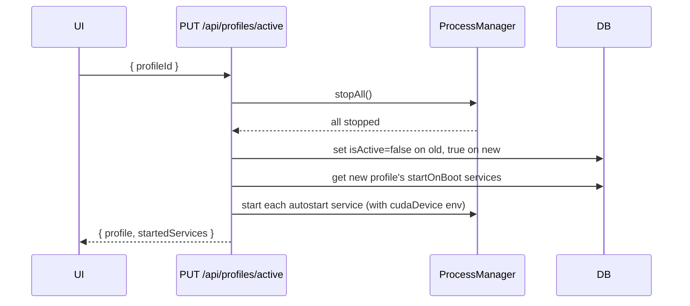
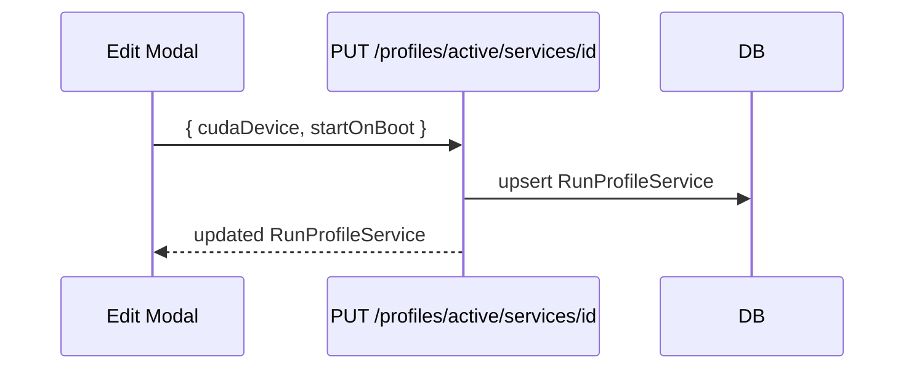

# TDD: Run Profiles

## Introduction

Service Manager currently stores `cudaDevice` and `startOnBoot` as global per-service fields. This works for a single hardware configuration but breaks down when you want to run the same services across different GPU setups (e.g., ComfyUI on a 5090 vs. a 3090) or selectively enable services per context. 

Run Profiles introduce a named configuration layer that overrides `cudaDevice` and `startOnBoot` per service, while keeping globally-shared fields (command, port, description) unchanged. Switching profiles stops all running services and auto-starts the profile's configured services.

## Goals and Non-Goals

**Goals**
- Store multiple named profiles, each holding per-service `cudaDevice` and `startOnBoot` overrides
- UI dropdown to switch profiles; `+` button clones current profile
- Service card Edit reflects active profile's values; saving `cudaDevice` writes to the profile
- Editing `command` or `port` applies globally, not per-profile
- Switching profiles: stop all → start profile's auto-start services
- Visual indicators on Edit modal distinguishing global vs. profile-specific fields

**Non-Goals**
- Per-profile port overrides
- Per-profile command/script overrides
- Multiple simultaneous active profiles
- Profile deletion (v1)

---

## Problem Statement

Currently `cudaDevice` and `startOnBoot` live on the `Service` row. There is no way to say "run this same service on GPU 1 in profile A, GPU 0 in profile B, and disabled in profile C." Users must manually edit each service when switching hardware setups, which is error-prone and slow. There is also no concept of a named configuration—each manual change destroys the previous state.

---

## Architectural Overview

```mermaid
graph TD
    UI[Main Screen] -->|dropdown select| ProfileAPI[/api/profiles]
    UI -->|+ clone| ProfileAPI
    UI -->|switch profile| SwitchAPI[/api/profiles/active]

    EditModal[Edit Service Modal] -->|save cudaDevice / startOnBoot| ServiceProfileAPI[/api/profiles/active/services/id]
    EditModal -->|save command / port| GlobalServiceAPI[/api/services/id]

    SwitchAPI -->|stop all| ProcessManager
    SwitchAPI -->|start autostart services| ProcessManager

    ProfileAPI --> DB[(SQLite via Prisma)]
    ServiceProfileAPI --> DB
    GlobalServiceAPI --> DB
```

---

## Detailed Technical Sections

### Data Model

```prisma
model RunProfile {
  id        String               @id @default(cuid())
  name      String
  isActive  Boolean              @default(false)
  createdAt DateTime             @default(now())
  updatedAt DateTime             @updatedAt
  services  RunProfileService[]
}

model RunProfileService {
  id          String     @id @default(cuid())
  profileId   String
  serviceId   String
  cudaDevice  String?
  startOnBoot Boolean    @default(false)
  profile     RunProfile @relation(fields: [profileId], references: [id])
  service     Service    @relation(fields: [serviceId], references: [id])

  @@unique([profileId, serviceId])
}
```

- `Service` model: remove `cudaDevice` and `startOnBoot` (or keep as legacy defaults for migration).
- One `RunProfile` has `isActive = true` at any time (enforced in service layer).
- Every service always has a `RunProfileService` row for every profile (created on profile clone or service creation).

### Components and Interfaces

#### New API Routes

| Route | Method | Purpose |
|---|---|---|
| `/api/profiles` | GET | List all profiles |
| `/api/profiles` | POST | Create profile (clones active) |
| `/api/profiles/active` | GET | Get active profile with service overrides |
| `/api/profiles/active` | PUT | Switch active profile (stops all, starts auto-starts) |
| `/api/profiles/[id]/services/[serviceId]` | PUT | Update profile-specific fields (cudaDevice, startOnBoot) |

#### Modified API Routes

- `PUT /api/services/[id]` — only accepts `name`, `description`, `command`, `port` (global fields)

#### TypeScript Types

```typescript
interface RunProfile {
  id: string
  name: string
  isActive: boolean
  services: RunProfileService[]
}

interface RunProfileService {
  serviceId: string
  cudaDevice: string | null
  startOnBoot: boolean
}

// Enriched service view (merged global + active profile)
interface ServiceView extends Service {
  cudaDevice: string | null
  startOnBoot: boolean
}
```

#### UI Changes

**Main screen (header area near Kill Port):**
```
[Active Profile: Image First - 5090 ▼]  [+]
```
- Dropdown lists all profiles; selecting one calls `PUT /api/profiles/active`
- `+` clones current profile, prompts for name

**Edit Service Modal:**
- `CUDA Device` and `Auto Start` fields labeled with a badge: `[profile]`
- `Command`, `Port` fields labeled: `[global]`
- Small legend at bottom: "Profile fields apply to the current profile only"

### Data Flows

#### Switch Profile Flow



#### Edit Service (Profile Field) Flow



#### Process Spawn with cudaDevice

`process-manager.ts` already injects env vars. The spawn call gains:
```typescript
env: { ...process.env, CUDA_VISIBLE_DEVICES: cudaDevice ?? undefined }
```
`cudaDevice` is sourced from the active `RunProfileService`, not from the `Service` row.

---

## Alternatives Considered

| Option | Pros | Cons |
|---|---|---|
| **Profile overrides table** (chosen) | Clean separation; service list unchanged; easy clone | Requires join on every service read |
| **Duplicate service rows per profile** | Simple queries | Massive data duplication; command edits must fan out |
| **JSON blob on Profile** | Zero schema migration | Unqueryable; harder to enforce consistency |
| **Keep fields on Service, add profile FK** | Minimal change | Can't have per-service per-profile values |

---

## Testing Strategy

Integration tests (real SQLite, real HTTP routes via `supertest` or Next.js test helpers):

```
describe('Run Profiles')

  it('GET /api/profiles returns all profiles with service overrides')

  it('POST /api/profiles clones active profile service settings into new profile')

  it('PUT /api/profiles/active stops all running services')

  it('PUT /api/profiles/active starts only startOnBoot=true services for new profile')

  it('PUT /api/profiles/active sets isActive=true on selected, false on others')

  it('PUT /api/profiles/[id]/services/[serviceId] updates cudaDevice for profile only')

  it('PUT /api/profiles/[id]/services/[serviceId] does not affect other profiles')

  it('PUT /api/services/[id] ignores cudaDevice and startOnBoot fields')

  it('service spawned with CUDA_VISIBLE_DEVICES from active profile')

  it('creating a new service adds RunProfileService rows for all existing profiles')
```

Component tests (React Testing Library):

```
it('profile dropdown renders active profile name')
it('selecting profile calls PUT /api/profiles/active')
it('+ button prompts for name and calls POST /api/profiles')
it('Edit modal shows [profile] badge on cudaDevice and startOnBoot')
it('Edit modal shows [global] badge on command and port')
```
